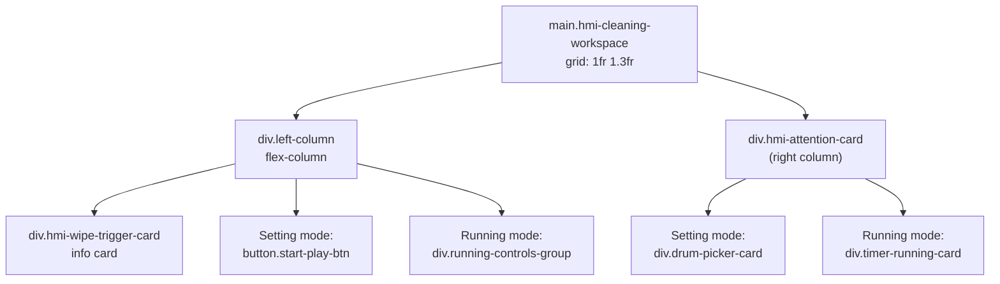

## Product Overview

Restyle the Warmup page (`Warmup.razor` + `Warmup.razor.css`) into a clean two-column layout within a single view. Right column shows the timer (drum picker or running countdown), left column shows the info card with the play button directly below it. No features, logic, or event handlers are changed — only layout and styling.

## Core Features

- Two-column grid: left = info card + play button stacked vertically; right = timer card + controls
- Fix incorrect CSS class name (`.hmi-monitor-workspace` → `.hmi-cleaning-workspace`)
- Add missing scoped styles for drum picker, timer running card, progress ring, and action controls (currently unstyled because they only exist in `UVTimer.razor.css`)
- Minimal markup rearrangement to place play button under info card (no C# changes)

## Tech Stack

- Blazor Server (.NET 8) with scoped CSS isolation (`Warmup.razor.css`)
- Existing pattern: CSS Grid two-column layout (`grid-template-columns: 1fr 1.3fr`) from `LcdCleaning.razor.css`

## Implementation Approach

The current `Warmup.razor` already uses `<main class="hmi-cleaning-workspace">` with two child divs — but the CSS file accidentally names the class `.hmi-monitor-workspace`, so the grid never applies. Additionally, the timer sub-components (`drum-picker-card`, `wheel-section`, `timer-running-card`, `progress-ring`, `running-controls-group`, etc.) have **zero CSS definitions** in `Warmup.razor.css`; they only exist as scoped styles in `UVTimer.razor.css` and therefore don't render correctly in Warmup.

**Strategy:**

1. **Markup** — Move the play button (`.start-play-btn`) and the running-mode controls (`.running-controls-group`) out of `.hmi-attention-card` into the left column, directly below `.hmi-wipe-trigger-card`. Wrap both columns in a left-column container div. No `@onclick`, no parameters, no C# logic changes.
2. **CSS** — Fix the class name, add the full set of missing timer/drum-picker/running styles (adapted from `UVTimer.razor.css` to Warmup's cyan-blue palette), and style the left column as `flex-direction: column` so the card sits on top and the button below.

**Key decisions:**

- Pure CSS cannot relocate an element to a different DOM parent, so a minimal HTML restructure is necessary. This changes only element nesting, not any feature or behavior.
- Copying timer styles into `Warmup.razor.css` (rather than extracting to a shared stylesheet) follows the existing project convention where each component has its own scoped CSS file.

## Implementation Notes

- The `.hmi-cleaning-workspace` grid pattern already exists in `LcdCleaning.razor.css` — reuse the same `grid-template-columns: 1fr 1.3fr; gap: 18px` for visual consistency.
- The drum picker and timer styles from `UVTimer.razor.css` use a purple theme (`rgba(126, 34, 206, ...)`) — adapt all accent colors to cyan (`rgba(56, 189, 248, ...)`) to match Warmup's existing card styling.
- The `@if/else` conditional block that switches between setting mode and running mode must stay intact; only the wrapping `<div>` structure changes.
- Preserve all existing `@onclick`, `@bind`, `disabled`, and `@onwheel` attributes exactly as-is.

## Architecture Design

No architectural changes. The component keeps the same parameters, event callbacks, and timer logic. Only the DOM nesting within `<main>` and the scoped CSS change.



## Directory Structure

```
project-root/
├── Components/
│   └── Admin/
│       ├── Warmup.razor          # [MODIFY] Restructure DOM: move play button + running controls into left column wrapper. Keep all @onclick/@bind/disabled attributes unchanged. No C# changes.
│       └── Warmup.razor.css      # [MODIFY] Fix .hmi-monitor-workspace→.hmi-cleaning-workspace; add missing drum-picker, timer-running, progress-ring, running-controls styles (cyan theme); add left-column flex layout.
└── Components/
    └── Dashboard/
        └── UVTimer.razor.css      # [READ-ONLY REFERENCE] Source of timer/drum-picker styles to adapt and copy into Warmup.razor.css
```

### File Details

**`Warmup.razor` [MODIFY]**

- Wrap `.hmi-wipe-trigger-card` + play button/running controls in a new `<div class="warmup-left-column">`
- Move `.start-play-btn` and `.running-controls-group` from inside `.hmi-attention-card` to inside the left column div
- Keep `.hmi-attention-card` containing only the drum picker (setting mode) or timer-running-card (running mode)
- All `@onclick`, `@bind`, `disabled`, `@onwheel` handlers stay exactly as-is

**`Warmup.razor.css` [MODIFY]**

- Fix line 1: `.hmi-monitor-workspace` → `.hmi-cleaning-workspace`
- Add `.warmup-left-column { display: flex; flex-direction: column; align-items: center; gap: 1.5rem; }`
- Add all missing styles adapted from `UVTimer.razor.css`: `.drum-picker-card`, `.gloss-overlay`, `.picker-header`, `.format-label`, `.wheel-section`, `.magnifier-slot`, `.timer-running-card`, `.progress-ring-wrapper`, `.progress-ring`, `.ring-bg`, `.ring-fill`, `.countdown-readout`, `.live-digits`, `.progress-percent`, `.running-controls-group`, `.hmi-action-btn`, `.action-icon`, `.pause-btn`, `.resume-btn`, `.reset-btn`, `.btn-disabled`, `.tile-icon`
- Adapt purple accents → cyan accents throughout